<p align="center">
  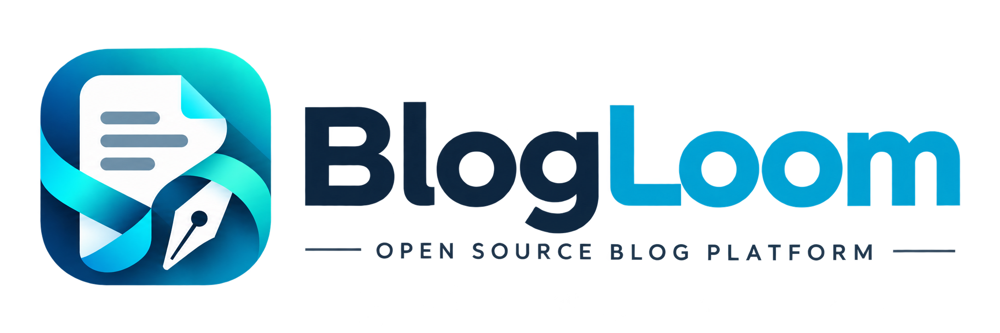
</p>

<h1 align="center">BlogLoom</h1>

<p align="center">
  一套面向个人开发者与内容创作者的开源博客平台
</p>

<p align="center">
  从 Markdown 创作、内容管理和站点配置，到博客展示、评论互动与访问统计，集中在一套前后端分离系统中完成。
</p>

<p align="center">
  <a href="https://github.com/changluya/BlogLoom/actions/workflows/ci.yml"></a>
  <a href="https://github.com/changluya/BlogLoom/releases"></a>
  
  
  
  
  
  
</p>

## 项目简介

**BlogLoom** 是一套基于 Spring Boot、MyBatis 和 Vue 构建的博客前后端一体化平台。项目由公开博客前台、内容管理后台和后端服务三个主要模块组成，适合用于搭建个人技术博客、开源项目主页或可持续二次开发的内容平台。

BlogLoom 关注的不只是文章展示，还覆盖从内容生产到站点运营的完整链路：

```text
Markdown 创作 → 内容组织 → 审核与发布 → 前台展示 → 评论互动 → 访问分析 → 持续维护
```

当前版本基于 [Naccl/NBlog](https://github.com/Naccl/NBlog) 二次开发，在遵循原项目 MIT License 的基础上完成 BlogLoom 品牌化、工程整理和界面体验优化，并继续向更易部署、更易维护、更适合扩展的博客平台演进。

## 项目特点

- **前后端分离**：公开博客、管理后台和 REST API 独立运行、独立构建。
- **完整内容闭环**：覆盖文章创作、分类标签、专栏、评论、页面配置和前台展示。
- **Markdown 写作体验**：支持 Markdown 编辑、文章描述、目录、代码高亮与图片展示。
- **本地知识库**：以目录树管理文章，支持 ZIP 批量导入导出与文章元数据解析。
- **AI Skill 同步**：下载专属 AI 技能包后，用自然语言即可把本地 Markdown 文章导入、更新或查询，与后台导入能力行为一致。
- **可配置站点**：站名、图标、头像、页脚、社交链接、友链、关于页与自定义展示模块可集中维护。
- **运营数据可视化**：管理后台提供访问次数、访客人数、内容数量、分类与标签分布等概览。
- **内容安全**：文章删除后进入回收站，可恢复或彻底删除。
- **多种图片存储方式**：支持本地上传与阿里云 OSS 两种图床，并可在后台测试连通性。
- **Docker 一键部署**：一体化镜像（后端托管前台与后台页面）+ MySQL，命令化完成部署与增量升级。
- **日志与任务管理**：集中查看访问、登录、操作、异常和定时任务执行信息。
- **适合二次开发**：后端分层清晰，前台与后台管理端职责独立，方便更换主题或扩展接口。

## 系统组成

| 模块 | 职责 | 默认地址 |
| --- | --- | --- |
| `blog-view-ui` | 面向访客的博客门户、文章阅读与互动 | <http://localhost:8080> |
| `blog-cms-ui` | 面向站长的内容管理与运营后台 | <http://localhost:8079> |
| `blog-backend` | REST API、认证、业务逻辑、数据访问与任务调度 | <http://localhost:8090> |
| MySQL | 业务数据与缓存表（`cache_entry`）等持久化数据 | 数据库名 `blogloom` |

> 说明：缓存已由 MySQL 的 `cache_entry` 表实现，不再依赖 Redis。

```text
┌──────────────────────┐          ┌──────────────────────┐
│    blog-view-ui      │          │     blog-cms-ui      │
│  公开博客 / 访客端    │          │  内容管理 / 运营后台   │
└──────────┬───────────┘          └──────────┬───────────┘
           │            REST API             │
           └──────────────┬──────────────────┘
                          ▼
               ┌──────────────────────┐
               │    blog-backend      │
               │ Spring Boot/MyBatis  │
               └──────────┬───────────┘
                          ▼
               ┌──────────────────────┐
               │        MySQL         │
               │  业务数据 + 缓存表    │
               └──────────────────────┘
```

## 功能范围

### 博客前台

- 首页 Banner、站点导航、个人信息卡片和最新内容展示
- 文章列表、文章详情、Markdown 内容渲染和图片预览
- 按分类、标签、专栏和归档浏览文章
- 站内文章搜索
- 动态展示与点赞
- 评论与回复
- 友链页面、关于页面与自定义展示模块
- 响应式布局、资源懒加载与回到顶部等阅读体验

### 管理后台

- 数据仪表盘：访问次数、访客人数、文章数、评论数、分类与标签分布、访客地图
- 文章创作：Markdown 编辑、分类标签、专栏、描述、封面和发布配置
- 内容管理：文章、动态、分类、标签、专栏和评论维护
- 内容安全：文章回收站（恢复 / 彻底删除）
- 迁移与整理：本地知识库目录树、Markdown 批量导入导出、文章备份
- AI Skill 同步：下载专属技能包，用 AI 助手以自然语言完成本地文章导入、更新与查询
- 页面管理：站点设置、友链、关于页与自定义展示模块维护
- 图床管理：本地 / 阿里云 OSS 上传渠道配置与连通性测试
- 系统管理：账号维护和定时任务管理
- 日志中心：任务、登录、操作、异常和访问日志
- 访客统计：访问记录与访问行为分析

### 后端服务

- Spring Security + JWT 管理端身份认证
- MyBatis 数据访问与 PageHelper 分页
- MySQL 缓存表（`cache_entry`）及临时状态管理
- Quartz 定时任务
- CommonMark Markdown 解析
- 评论通知与邮件发送能力
- 本地上传与阿里云 OSS 上传适配
- IP 地域解析、客户端与访问来源识别
- 统一异常处理、操作日志和接口分层

## 产品展示

### 博客前台

| 博客首页 | 博客主页 | 文章阅读 | 文章归档 | 友人帐 | 关于我 |
| --- | --- | --- | --- | --- | --- |
| 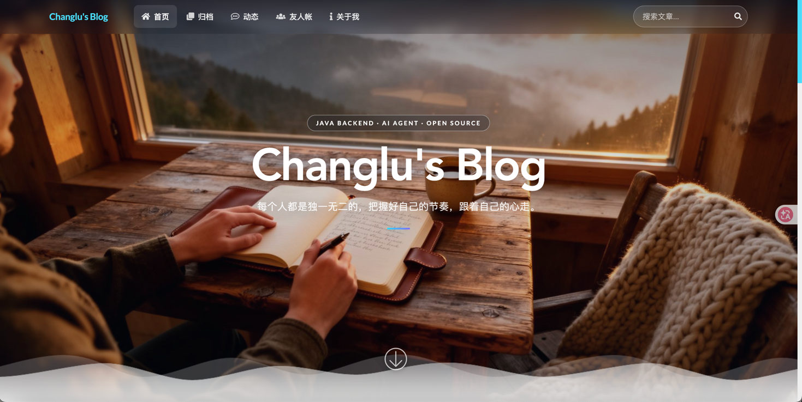 | 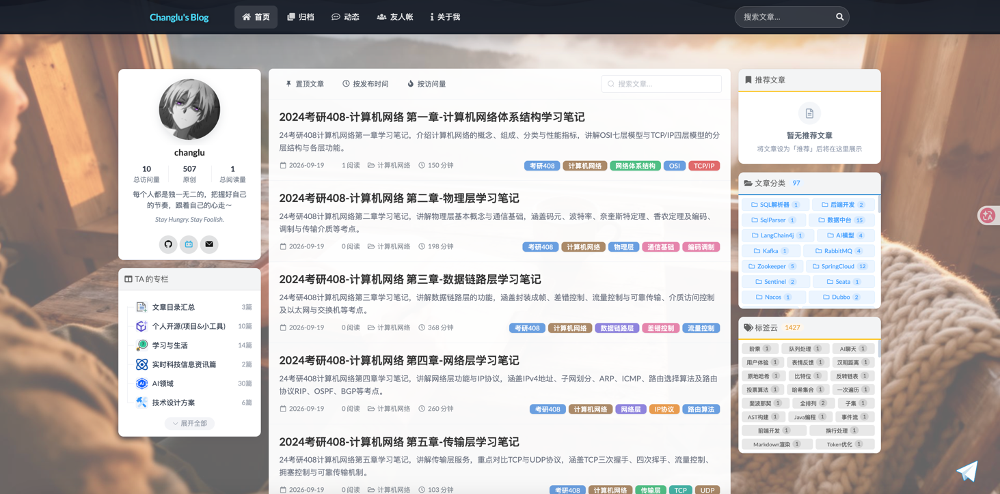 | 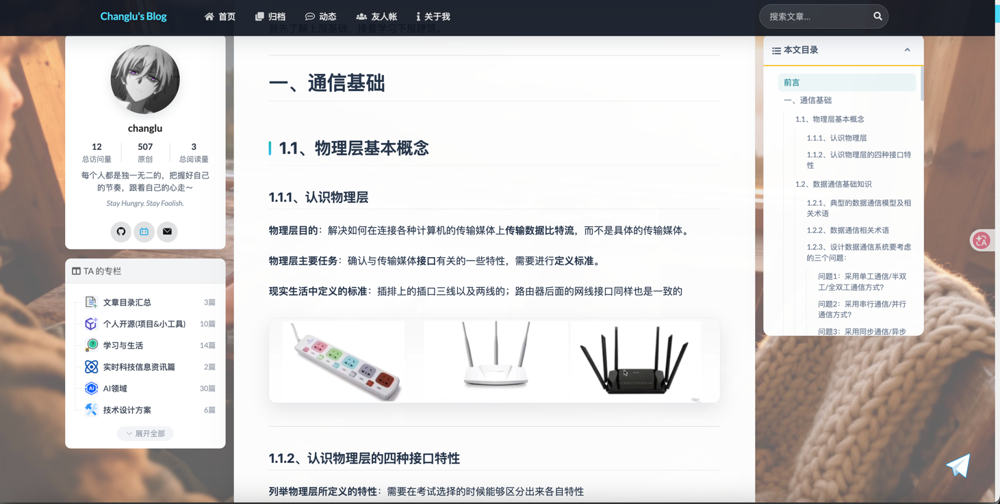 | 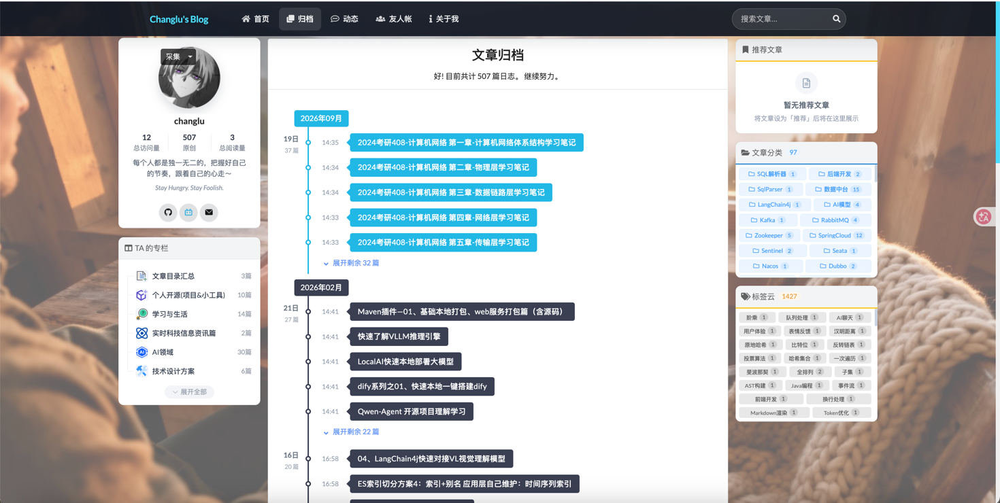 | 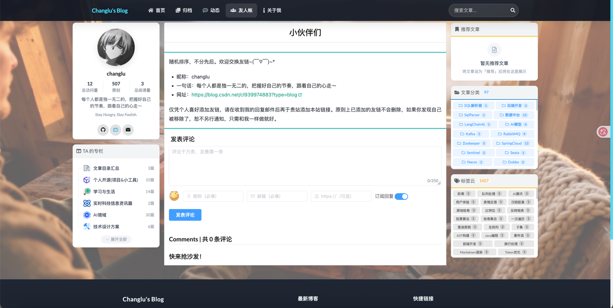 | 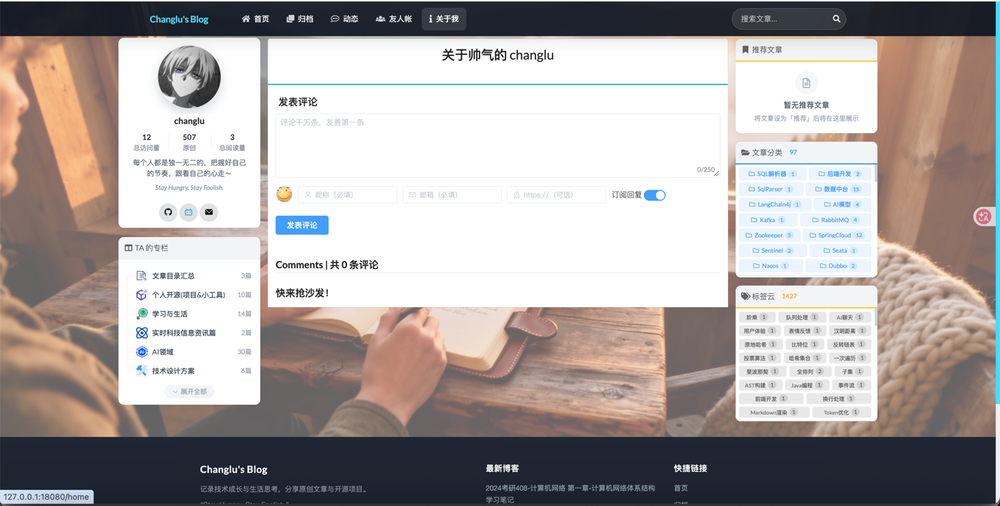 |

### 管理后台

| 数据概览 | 博客文章 | 博客专栏 | 知识库 | 图床管理 | 站点数据 | 访问日志 |
| --- | --- | --- | --- | --- | --- | --- |
| 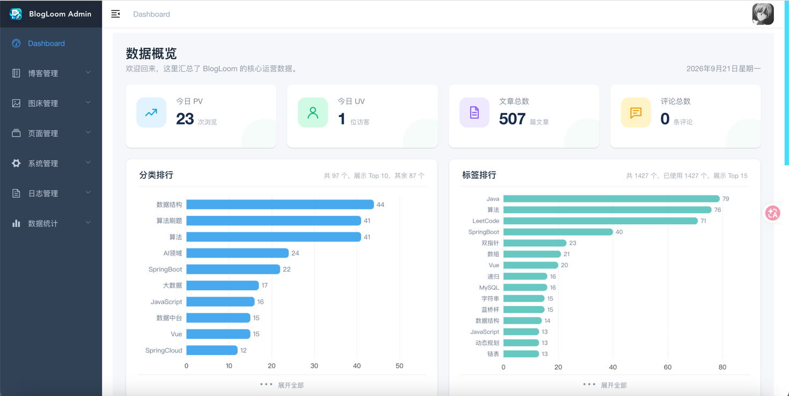 | 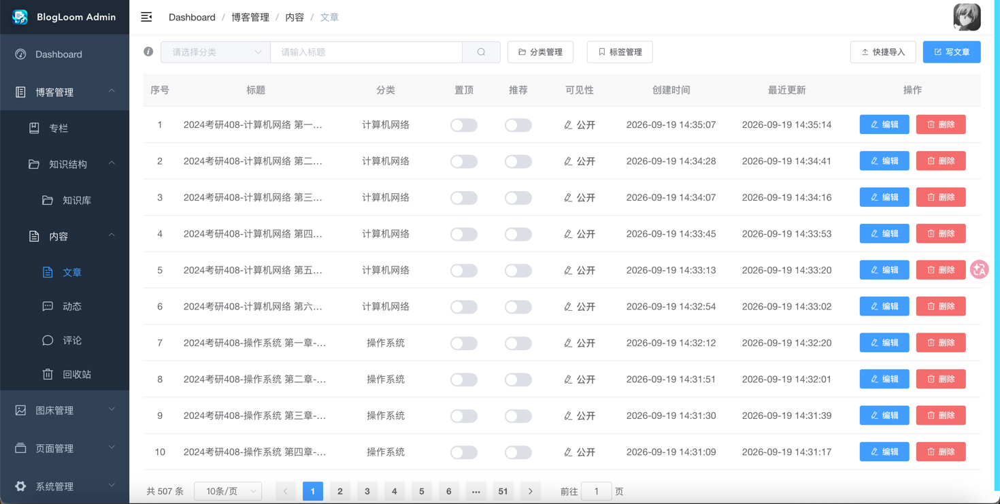 | 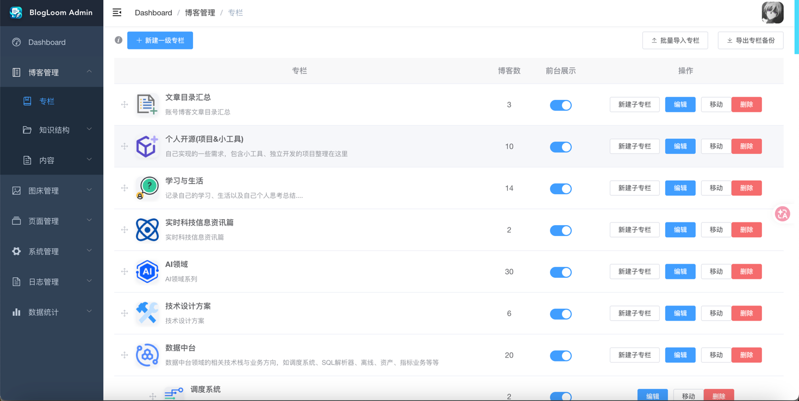 | 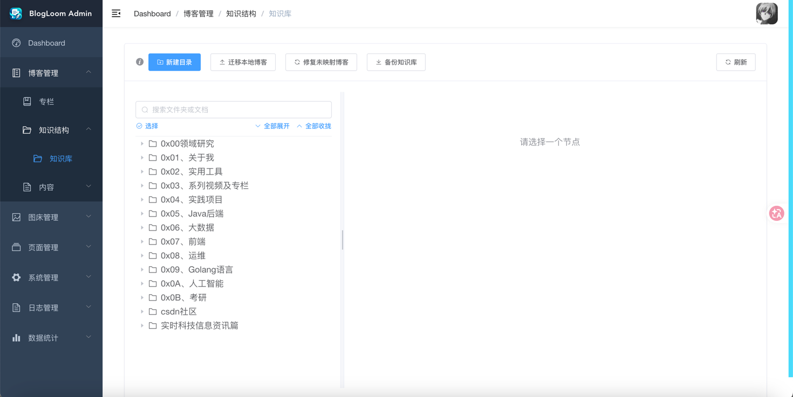 | 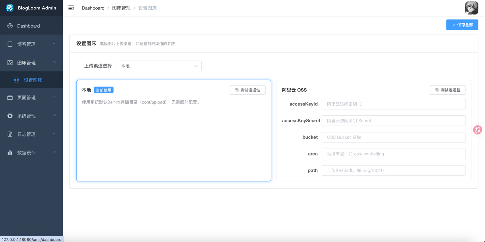 | 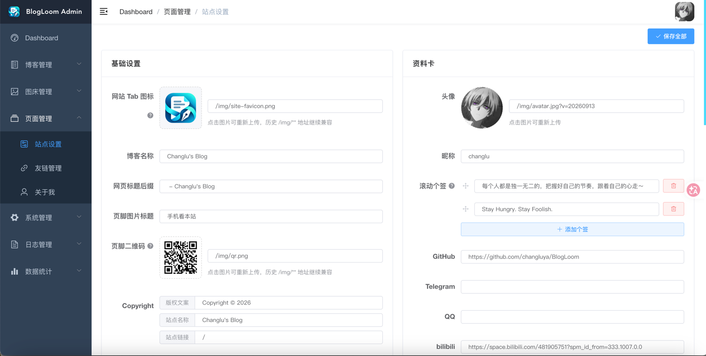 | 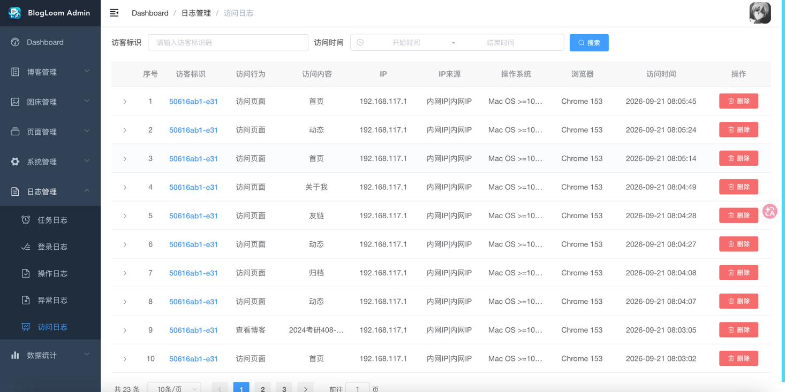 |

## 技术栈

| 范围 | 主要技术 |
| --- | --- |
| 后端基础 | Java 8、Spring Boot 2.2.7.RELEASE、Spring MVC |
| 数据与缓存 | MyBatis、PageHelper、MySQL（缓存由 `cache_entry` 表实现） |
| 安全与任务 | Spring Security、JWT、Quartz、Spring Retry |
| 内容与工具 | commonmark-java、ip2region、Yauaa、Hutool |
| 管理后台 | Vue 2.6.11、Vite 4.5.14、Element UI、Vuex、Vue Router、ECharts、mavon-editor |
| 博客前台 | Vue 2.6.11、Vite 4.5.14、Semantic UI、Element UI、Vuex、Vue Router |
| 网络与媒体 | Axios、sanitize-html、v-viewer、vue-lazyload |

## 目录结构

```text
BlogLoom/
├── assets/                         # README 与项目品牌资源
├── blog-backend/                   # Spring Boot 后端
│   ├── src/main/java/com/changlu/blogloom/
│   │   ├── controller/             # 公开端与管理端 REST 接口
│   │   ├── service/                # 业务服务及实现
│   │   ├── mapper/                 # MyBatis Mapper 接口
│   │   ├── entity/                 # 数据库实体
│   │   ├── model/                  # DTO 与 VO
│   │   ├── module/                 # 知识库、专栏、缓存等模块
│   │   ├── config/                 # 安全、Web、静态资源等配置
│   │   ├── task/                   # 定时任务
│   │   └── util/                   # Markdown、上传、通知等工具
│   ├── src/main/resources/         # 配置、Mapper XML 与静态资源
│   └── pom.xml
├── blog-cms-ui/                    # Vue 管理后台
├── blog-view-ui/                   # Vue 公开博客前台
├── sql/
│   └── increment/                  # 增量 SQL（含全量初始化基线）
│       └── 1.0/                    # 1.0 版本数据库脚本
├── conf/                           # 外置配置、日志和本地上传目录
├── docker/                         # Docker 一键部署（镜像、compose、脚本、用户版）
├── qa/                             # 压测与容量测试脚本
├── docs/                           # 产品与设计文档
├── bin/                            # 本地增量升级脚本
├── LICENSE                         # MIT License
└── README.md
```

## 快速开始

### 用户部署（推荐）

只想快速把博客跑起来？服务器安装 Docker 与 Docker Compose v2 后，一条命令即可完成部署，无需 JDK / Node / Maven，也无需克隆仓库：

```bash
mkdir blogloom && cd blogloom
curl -fsSL https://raw.githubusercontent.com/changluya/BlogLoom/master/docker/standalone/install.sh | bash
```

| 入口 | 地址 |
| --- | --- |
| 博客前台 | `http://<服务器IP>:18080` |
| 管理后台 | `http://<服务器IP>:18080/cms` |
| 默认账号 | `admin` / `123456`（登录后请立即修改） |

后续升级（自动拉取新版本，数据不丢失）：

```bash
cd blogloom
./upgrade.sh            # 自动解析最新版本并升级
./upgrade.sh 1.0.1      # 升级到指定版本
```

完整说明见 [docker/README.md](./docker/README.md)。

### 本地开发

环境要求：JDK 8+、Maven 3.6+、Node.js 16+ 与 npm、MySQL 5.7+ 或 MySQL 8。

**1. 初始化数据库**

创建数据库：

```sql
CREATE DATABASE blogloom
  CHARACTER SET utf8mb4
  COLLATE utf8mb4_unicode_ci;
```

配置连接后执行增量 SQL，首次运行即完成初始化（含全量基线）：

```bash
cp bin/local/deploy.conf.example bin/local/deploy.conf   # 填写数据库连接
./bin/local/upgrate-sql.sh
```

**2. 启动后端**

按需修改 `blog-backend/src/main/resources/application-dev.properties`（数据库、`token.secretKey`、`blog.api`/`blog.cms`/`blog.view` 等），然后：

```bash
cd blog-backend
mvn spring-boot:run
```

默认端口 `8090`。请勿把数据库密码、令牌密钥、邮箱授权码或对象存储密钥提交到版本库。

**3. 启动管理后台**

```bash
cd blog-cms-ui
npm install
npm run dev
```

默认 <http://localhost:8079>，API 地址由 `.env.development` 的 `VITE_API_URL` 控制。

**4. 启动博客前台**

```bash
cd blog-view-ui
npm install
npm run dev
```

默认 <http://localhost:8080>，API 地址由 `.env.development` 的 `VITE_API_URL` 控制。

## 默认管理账号

全量 SQL 初始化后的默认后台账号为：

```text
用户名：admin
密码：123456
```

首次登录后请立即修改默认密码，并为生产环境生成足够长且随机的 `token.secretKey`。

## 后续规划

- [ ] 升级至现代 JDK 与 Spring Boot 版本
- [ ] 管理后台迁移至 Vue 3、TypeScript 与新版组件体系
- [ ] 完善 SEO、Sitemap 和 RSS
- [ ] 增加前台 SSR/SSG 能力
- [ ] 建设可配置的主题与页面体系
- [ ] 支持多站点管理
- [ ] 扩展 CSDN、掘金、博客园等多渠道发布能力
- [ ] 增强媒体资源统一管理
- [ ] 引入 AI 辅助写作、摘要和内容整理能力
- [x] 提供 Docker Compose 一键部署方案（见 [docker/README.md](./docker/README.md)）

> 以上内容属于演进规划，不代表当前版本已实现。

## 参与贡献

欢迎通过 Issue 提交问题、建议或功能需求，也欢迎通过 Pull Request 参与改进。提交代码前建议：

1. 分别验证涉及模块可以正常构建。
2. 数据库结构或初始数据发生变化时，同步维护全量 SQL 与必要的增量 SQL。
3. 不提交本地日志、上传文件、真实账号密码和访问密钥。
4. 在变更说明中写清影响模块、验证方式和兼容性注意事项。

## 鸣谢

BlogLoom 基于 [Naccl/NBlog](https://github.com/Naccl/NBlog) 进行二次开发。感谢 Naccl 与 NBlog 的所有贡献者提供了优秀的开源基础，也感谢 Spring Boot、Vue、MyBatis、Element UI、Semantic UI 及项目所使用的其他开源项目。

## License

BlogLoom 使用 [MIT License](./LICENSE) 开源，并保留原项目许可要求中的版权与许可声明。
